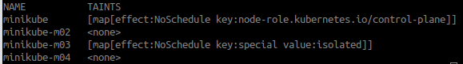

# Challenge 1: Modificación del Helm Chart para Reglas de Despliegue en AKS
Durante la fase de desarrollo del Challenge 1, se trabajará con Minikube. Utilizaremos un clúster compuesto por 4 nodos, incluyendo el nodo de control plane.

## Requisitos previos
- **Minikube:** Utilizado para crear y gestionar clústeres de Kubernetes localmente.
- **kubectl:** Necesario para interactuar con el clúster de Kubernetes y gestionar los pods y otros recursos.
- **Helm:** Requerido para modificar y desplegar el chart con las restricciones especificadas.

## Arquitectura del clúster
El clúster está compuesto por los siguientes nodos:

* minikube: Nodo de control plane.
* minikube-m02: Nodo sin restricciones (sin taints).
* minikube-m03: Nodo aislado para evitar la programación de pods regulares.
* minikube-m04: Nodo sin restricciones (sin taints).

### Objetivo 1: Aislar grupos de nodos específicos impidiendo que se programen pods en estos grupos de nodos.

Para este objetivo, aislaremos determinados nodos en el clúster utilizando taints, de manera que se controlará en qué nodos pueden ejecutarse los pods.

### 1. Creación del clúster 

Comando ejecutado para la creación del clúster con 4 nodos:

    minikube start --nodes 4 --driver=docker --memory 1900 --cpus 2

### 2. Aplicación de taints

Comando taint nodo aleatorio (minikube-m03):

    kubectl taint nodes minikube-m03 special=isolated:NoSchedule

Comando taint control-plane(minikube):

    kubectl taint nodes minikube node-role.kubernetes.io/control-plane=:NoSchedule

Imagen que muestra qué nodos tienen taints:

### 3. Verificación de los taints aplicados

Comando para ver a que nodo pertenece cada pod:

    kubectl get nodes -o custom-columns=NAME:.metadata.name,TAINTS:.spec.taints

Modificando el replicaCount en el fichero values.yaml, se ve como se respeta el taint añadido en ambos nodos.
Con esta configuración terminamos el primer punto del challenge 1.

### Objetivo 2:  Asegurar que un pod no se programe en un nodo que ya tiene un pod del mismo tipo.

Para evitar tener pods repetidos en un mismo nodo vamos ha hacer uso de la Anit-Affinity. Esto garantizará que los pods se distribuyan en nodos diferentes.

He aumentado el número de nodos del clúster a 5 para dar mayor flexibilidad en la distribución de los pods.

Comando para añadir un nodo:

    minikube node add

Se ha realizado los siguientes cambios en el archivo deployment.yaml para evitar que los pods del mismo tipo se ejecuten en el mismo nodo:

    affinity:
    podAntiAffinity:
        requiredDuringSchedulingIgnoredDuringExecution:
        - labelSelector: {}
            topologyKey: "kubernetes.io/hostname"

### Verificación del funcionamiento

Para comprobar el correcto funcionamiento pondremos el replicaCount a 5:

Al tener solamente 3 nodos, Kubernetes puede ejecutar un máximo de 3 pods, los otros quedan en estado "Pending".

Después de reducir el replicaCount a 3, los pods pueden distribuirse correctamente entre los nodos disponibles:

### Objetivo 3: Que los pods se despliegen en diferentes zonas de disponibilidad.

Para simular distintas zonas de disponibilidad en nuestro clúster, hemos etiquetado los nodos con la etiqueta topology.kubernetes.io/zone=zone-{a}. Esto permitirá que Kubernetes entienda a qué zona pertenece cada nodo y programe los pods de forma distribuida.

De modo que tenemos los nodos en las siguientes zonas de disponibilidad

#### Aplicación de restricciones de distribución en deployment.yaml
Para asegurarnos de que los pods se distribuyan de manera uniforme entre las diferentes zonas de disponibilidad, hemos agregado las siguientes restricciones de dispersión topológica (topology spread constraints) en el archivo deployment.yaml:

      topologySpreadConstraints:
        - maxSkew: 1
          topologyKey: topology.kubernetes.io/zone
          whenUnsatisfiable: DoNotSchedule
          labelSelector:
            matchLabels:
              app.kubernetes.io/instance: {{ .Release.Name }} 

Con esta configuración, nos aseguramos de que los pods se distribuyan uniformemente entre las diferentes zonas de disponibilidad, mejorando la resiliencia y tolerancia a fallos en nuestro clúster.

### Objetivo 4: Asegurar que se ejecute un script aleatorio en cada actualización de Helm.
Cada vez que actualizamos la release, queremos que se lanze un script aleatorio. El funcionamiento que se ha implementado es el sigueinte:

1. Creación de un fichero random-script-job.yaml en el que definiremos una job en la fase de post-upgrade.
2. Creación de tres scripts simples.
3. Crear una imagen de docker y subirla en Docker Hub.
4. Creación de un priorityClass para asegurarnos de que siempre se ejecute la job.

#### random-script-job.yaml
Este archivo define un Job que ejecuta un script aleatorio desde una lista predefinida. Utiliza la imagen martinetto/my-random-scripts:latest y selecciona aleatoriamente uno de los scripts especificados en Values.job.scripts. El Job tiene una alta prioridad (high-priority) para asegurar que se ejecute antes que otros pods en el clúster. Además, está configurado como un hook post-upgrade en Helm, lo que significa que se ejecutará automáticamente después de una actualización del chart.

#### Creación de tres scripts simples
En esta fase, se ha desarrollado un Dockerfile que crea una imagen basada en Alpine Linux con tres scripts simples, cada uno de los cuales realiza una tarea específica. La imagen utiliza bash para ejecutar los scripts y los hace ejecutables dentro del contenedor.

Base de la imagen: alpine:latest, una imagen ligera y minimalista de Linux.
Instalación de bash: Usamos apk add --no-cache bash para instalar bash en Alpine, ya que Alpine utiliza sh de manera predeterminada y necesitamos bash para los scripts.

Scripts:
1. script1.sh: Muestra la hora actual utilizando el comando date.
2. script2.sh: Ejecuta una tarea personalizada, mostrando un mensaje de texto.
3. script3.sh: Proporciona información del sistema con el comando uname -a.

Este archivo define una PriorityClass en Kubernetes que asigna una alta prioridad a los pods que usan esta clase. En este caso, se utiliza para asegurar que los pods que ejecutan un script aleatorio tengan preferencia en la programación.

#### Creación de un priorityClass

    apiVersion: scheduling.k8s.io/v1
    kind: PriorityClass
    metadata:
        name: high-priority
    value: 100000
    globalDefault: false
    description: "Esta prioridad es para lanzar un script aleatorio."

Definiendo esta priorityClass se garantiza que el Job que ejecuta el script aleatorio se programe antes que otros pods, dándole prioridad en situaciones de recursos limitados.